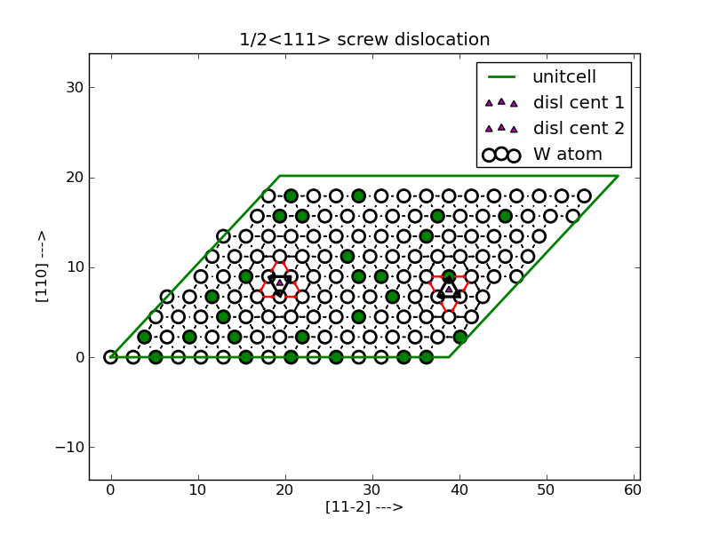

.. module:: stool

 
Screw dislocation in Spezial Quasirandom Structure
====================================================

This class is used to generate the Special Quasirandom Structure (SQS) to model the 1/2<111>
screw dislocation in a binary bcc lattice. It redefines a bcc lattice with c axis along <111> and inserts the dislocation dipole.
Then it generates the SQS for a given concentration.
 
Example
--------
To get a RandomSQS one initializes the RandomSQS object

.. literalinclude:: Randomsqs.py

The resulting structure has two screw dislocations:

Interface
---------

.. autoclass::  SQSscrew
   :members:

 